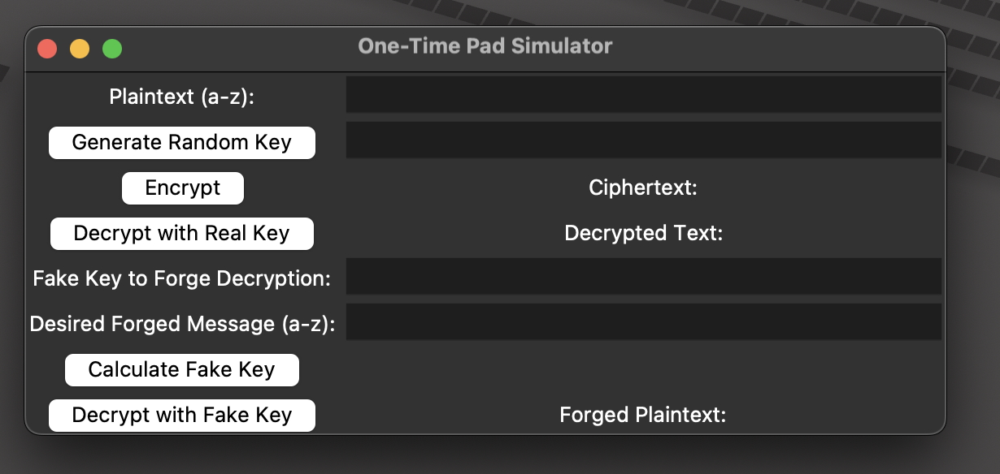

# One-Time Pad (OTP) Simulator

This simulator demonstrates how a One-Time Pad encryption system works and illustrates both its security properties and vulnerabilities.

## Overview

One-Time Pad is a cryptographic technique that uses a random secret key of the same length as the message. When implemented correctly, it provides perfect secrecy (information-theoretic security). This simulator demonstrates:

1. How OTP encryption works using XOR operations
2. The correct decryption process using the original key
3. The vulnerability of OTP if the same key is reused
4. How an attacker with knowledge of the ciphertext can forge arbitrary plaintexts by creating fake keys

## Features

- Encrypt messages using a randomly generated or user-provided key
- Decrypt messages using the correct key
- Generate fake keys to forge any arbitrary plaintext message
- Visual demonstration of the XOR operations
- Support for all lowercase English letters (a-z)

## Requirements

- Python 3.x
- Tkinter (usually comes pre-installed with Python)

## Running the Simulator

1. Make sure you have Python installed on your system.
2. Navigate to the directory containing `otp_simulator.py` in your terminal:
   ```
   cd /path/to/OTP-Simulator
   ```
3. Run the script:
   ```
   python3 otp_simulator.py
   ```

## ScreenShots



## How to Use

1. **Encrypting a message**:

   - Enter your plaintext message in the "Plaintext (a-z)" field
   - Click "Generate Random Key" or provide your own key
   - Click "Encrypt" to see the ciphertext
2. **Decrypting a message**:

   - After encrypting a message, click "Decrypt with Real Key"
   - The original plaintext will be displayed
3. **Forging a message**:

   - After encrypting a message, enter your desired forged text in the "Desired Forged Message" field
   - Click "Calculate Fake Key"
   - The fake key will be automatically calculated and placed in the "Fake Key" field
   - Click "Decrypt with Fake Key" to see how the ciphertext can be "decrypted" to produce your desired message

## Educational Value

This simulator visually demonstrates several key cryptographic concepts:

1. **Perfect Secrecy**: When implemented correctly with truly random, never-reused keys, OTP is unbreakable.
2. **XOR Properties**: Shows how binary XOR operations work in cryptography.
3. **Malleability**: Demonstrates that OTP (and many stream ciphers) are malleable, meaning attackers can make targeted changes to the ciphertext.
4. **Key Reuse Danger**: Implies the critical importance of never reusing OTP keys.
5. **Message Integrity**: Shows that OTP provides confidentiality but not message integrity - an attacker can forge messages.

## Encoding System

The simulator uses a 5-bit binary encoding for each lowercase letter (a-z), where:

- 'a' is encoded as '00000'
- 'b' is encoded as '00001'
- ...
- 'z' is encoded as '11001'

When messages are encrypted, the plaintext is first converted to this binary encoding, then XORed with the key.

## Security Note

This is an educational simulator designed to demonstrate cryptographic principles. Do not use this implementation for actual security purposes. Real cryptographic implementations require:

1. Truly random key generation
2. Secure key distribution
3. Key management to prevent reuse
4. Message authentication to prevent tampering
